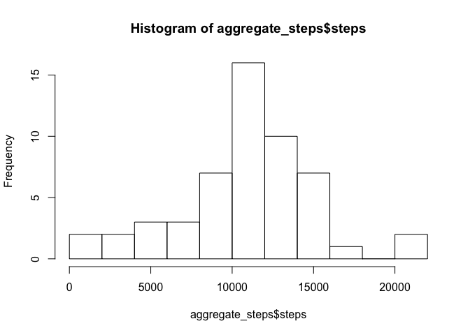
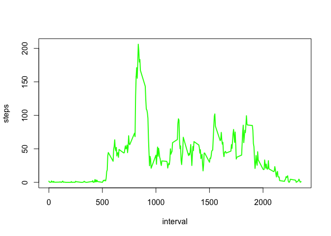
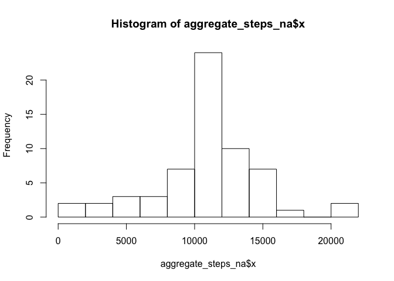
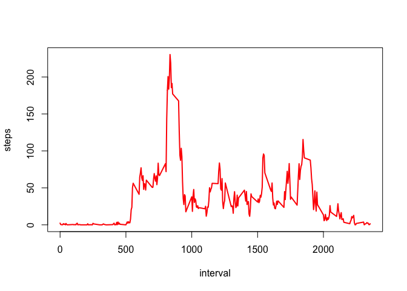
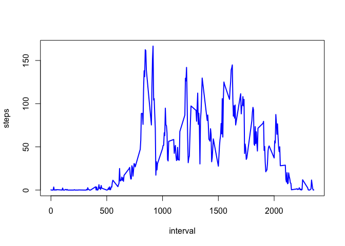

# Reproducible Research: Peer Assessment 1
## Summary
This assignment makes use of data from a personal activity monitoring device. This device collects data at 5 minute intervals through out the day. The data consists of two months of data from an anonymous individual collected during the months of October and November, 2012 and include the number of steps taken in 5 minute intervals each day.

## Loading and preprocessing the data

```r
library(knitr)
opts_chunk$set(echo=TRUE, warning=FALSE)
```
Load the data from URL in order the research to be reproductible

```r
library(RCurl)
```

```
## Loading required package: bitops
```

```r
temp <- tempfile()
download.file("https://d396qusza40orc.cloudfront.net/repdata%2Fdata%2Factivity.zip",temp, method = "curl")
activity_ini <- read.csv(unz(temp, "activity.csv"))
activity <- na.omit(activity_ini)
```

## What is mean total number of steps taken per day?
Total step taken by day

```r
total_steps <- sum(activity$steps)
total_steps
```

```
## [1] 570608
```


```r
aggregate_steps <- aggregate(activity$steps, list(date = activity$date), sum)
names(aggregate_steps) <- c("date", "steps")
hist(aggregate_steps$steps, breaks=10)
```

 

The mean of the total number of steps taken per day

```r
average_steps <- mean(aggregate_steps$steps,na.rm = TRUE)
average_steps
```

```
## [1] 10766.19
```

The median of the total number of steps taken per day

```r
median_steps <- median(aggregate_steps$steps,na.rm = TRUE)
median_steps
```

```
## [1] 10765
```

## What is the average daily activity pattern?

```r
aggregate_interval <- aggregate(activity$steps, list(date = activity$interval), mean)
names(aggregate_interval) <- c("interval", "steps")
```

```r
plot(aggregate_interval$interval, aggregate_interval$steps, type="l", xlab= "interval", ylab= "steps", col="green" , lwd=2)
```

 

The max steps are taken during this interval

```r
aggregate_interval[which.max(aggregate_interval$steps), ]
```

```
##     interval    steps
## 104      835 206.1698
```

## Imputing missing values
Count the NA values

```r
row.has.na <- apply(activity_ini, 1, function(x){any(is.na(x))})
sum(row.has.na)
```

```
## [1] 2304
```

Replace NA values by the value of the mean of this interval 

```r
activity_na <- apply(activity_ini, 1, function(x) if (is.na(x))  c(as.numeric(aggregate_interval[aggregate_interval$interval==as.numeric(x[3]), ]$steps),x[2],x[3]) else c(x[1],x[2],x[3]))

activity_na <- t(activity_na)
activity_na<- as.data.frame(activity_na, stringsAsFactors = FALSE)
names(activity_na) <- c("steps", "date", "interval")
```

Check that NA values have been removed

```r
row.has.na <- apply(activity_na, 1, function(x){any(is.na(x))})
sum(row.has.na)
```

```
## [1] 0
```

The mean and median of the total number of steps taken per day with NA values filled

```r
aggregate_steps_na <- aggregate(as.numeric(as.character(activity_na$steps)), list(date = activity_na$date), sum)
mean(as.numeric(as.character(aggregate_steps_na$x)))
```

```
## [1] 10766.19
```

```r
median(as.numeric(as.character(aggregate_steps_na$x)))
```

```
## [1] 10766.19
```


```r
hist(aggregate_steps_na$x, breaks=10)
```

 

## Are there differences in activity patterns between weekdays and weekends?
Add a column to indicate if it is a weekday or weekend. 
Note that this comparaison depends on your system language

```r
days <- apply(activity_na, 1, function(x) if (weekdays(as.POSIXlt(x[2])) == "Samedi" | weekdays(as.POSIXlt(x[2])) == "Dimanche") "weekend"  else "weekday")
activity_na[, "days"] <- days
```


```r
aggregate_interval_weekday <- aggregate(as.numeric(as.character(activity_na[activity_na$days == "weekday", ]$steps)), list(date = activity_na[activity_na$days == "weekday", ]$interval), mean)
names(aggregate_interval_weekday) <- c("interval", "steps")
plot(aggregate_interval_weekday$interval, aggregate_interval_weekday$steps, type="l", xlab= "interval", ylab= "steps", col="red" , lwd=2)
```

 

```r
aggregate_interval_weekend <- aggregate(as.numeric(as.character(activity_na[activity_na$days == "weekend", ]$steps)), list(date = activity_na[activity_na$days == "weekend", ]$interval), mean)
names(aggregate_interval_weekend) <- c("interval", "steps")
plot(aggregate_interval_weekend$interval, aggregate_interval_weekend$steps, type="l", xlab= "interval", ylab= "steps", col="blue" , lwd=2)
```

 
